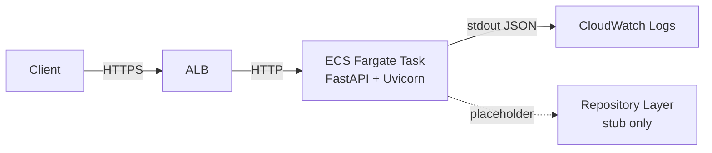
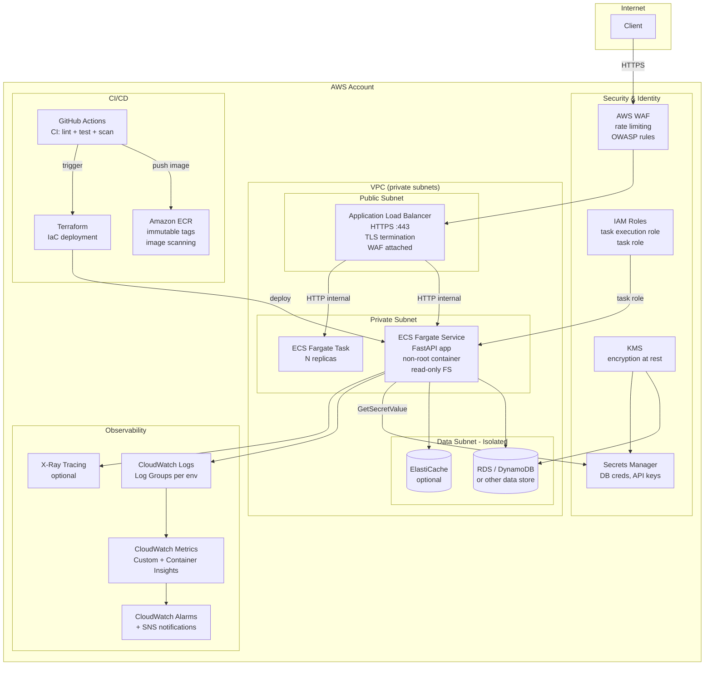
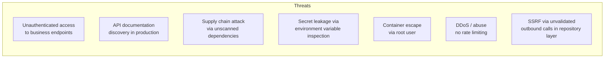
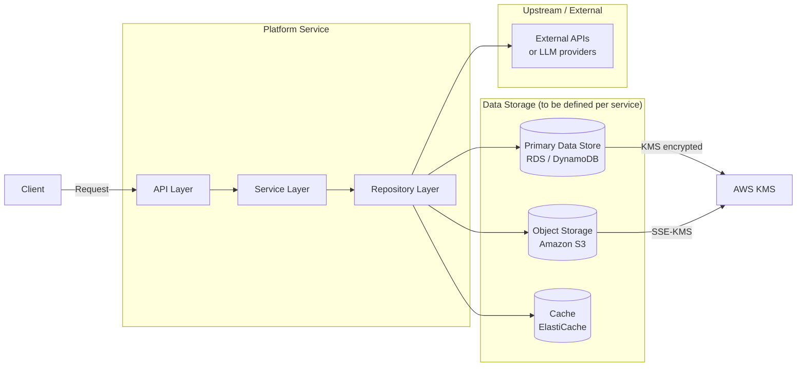

# Production Readiness Review

**Document type:** Solution Design / Production Readiness Review / Architecture Review Board  
**Prepared:** 2026-07-03  
**Repository:** `aws-python-platform-template`  
**Status:** Draft — Pending Architecture Review Board

---

## Table of Contents

1. [Executive Summary](#1-executive-summary)
2. [Product Definition](#2-product-definition)
3. [Production Architecture](#3-production-architecture)
4. [Production Readiness Assessment](#4-production-readiness-assessment)
5. [Security Review](#5-security-review)
6. [Data Architecture](#6-data-architecture)
7. [Operational Readiness](#7-operational-readiness)
8. [AI/ML Readiness](#8-aiml-readiness)
9. [Testing Strategy](#9-testing-strategy)
10. [CI/CD Design](#10-cicd-design)
11. [Infrastructure Requirements](#11-infrastructure-requirements)
12. [Product Backlog](#12-product-backlog)
13. [Production Go-Live Checklist](#13-production-go-live-checklist)
14. [Final Recommendation](#14-final-recommendation)

---

## 1. Executive Summary

### Purpose

`aws-python-platform-template` is a scaffold repository providing a production-oriented Python service baseline designed to be deployed on AWS infrastructure provisioned by a companion Terraform template. It is not a completed product — it is an opinionated starting point for building containerised Python microservices.

### Business Problem

Engineering teams building new AWS-hosted Python services repeatedly solve the same boilerplate concerns (logging, configuration, health checks, containerisation, CI). This template eliminates that duplication and encodes platform conventions from day one.

### Target Users

- Platform engineers establishing new microservice repositories
- Product engineering teams building on an AWS Fargate-based platform
- Internal developers who consume the template to scaffold a net-new service

### Expected Benefits

| Benefit | Description |
|---|---|
| Reduced time-to-first-deploy | Teams start from a working, CI-enabled baseline rather than blank canvas |
| Consistent platform conventions | JSON logging, health checks, config handling are standardised across services |
| Reduced security debt | Non-root container, secrets management guidance, environment-based config baked in from day one |
| Faster onboarding | New engineers recognise the same structure across all services |

### Success Metrics

| Metric | Target |
|---|---|
| Time from template to first ECS deployment | < 1 working day |
| Services adopting template patterns | 100% of new services |
| CI pass rate on first commit | ≥ 95% |
| Zero hardcoded secrets in derived services | 100% |
| Health check accuracy (ready endpoint reflects real dependency state) | 100% |

### Risks

| Risk | Likelihood | Impact |
|---|---|---|
| Teams copy the template but do not extend health checks | High | High — ALB routes traffic to broken services |
| `ENABLE_DOCS=true` default left on in production | High | Medium — API schema exposed publicly |
| Template used as a final product without filling stubs | Medium | High — placeholder repository and worker code in production |
| No authentication implemented by default | High | Critical — all derived services have no auth unless engineers add it |
| Dependency version ranges (not pinned) cause supply chain drift | Medium | Medium |

### Go/No-Go Decision

**AMBER — Conditional Go.** The template is sound in structure and intent. It is **not production-ready as shipped** for any service derived from it without completing the gaps identified in this document. The template itself should be treated as a scaffold, and a production hardening checklist must be completed before any derived service is promoted to production.

---

## 2. Product Definition

### Vision

Provide every Python service team with a single, opinionated, well-governed starting point that encodes platform conventions, so that engineering effort is spent on business logic rather than infrastructure plumbing.

### Value Proposition

A derived service that inherits this template ships to production faster, with fewer security and operational gaps, than one built from scratch. The template encodes what "good" looks like for this platform.

### User Personas

| Persona | Description |
|---|---|
| **Platform Engineer** | Maintains the template, enforces standards, reviews derived services |
| **Service Developer** | Clones the template, replaces stubs, builds domain logic |
| **SRE / Operations** | Deploys, monitors, and supports services derived from this template |
| **Security Architect** | Reviews derived services for compliance with platform security standards |

### User Journeys

**Journey 1 — New service creation**
1. Developer clones template
2. Renames package, updates `APP_NAME`
3. Replaces example repository/service with real integration
4. Extends `/health/ready` with real dependency checks
5. Adds authentication middleware
6. Pushes to GitHub, CI passes
7. Builds and pushes image to ECR
8. Terraform provisions ECS service using container image
9. Service is live and monitored

**Journey 2 — Platform engineer updates template**
1. Engineer identifies a new platform convention (e.g., request ID propagation)
2. Updates the template
3. Communicates change to service teams via changelog
4. Service teams adopt at next major version

### Functional Requirements

| ID | Requirement | Status |
|---|---|---|
| FR-01 | Expose `/health/live` and `/health/ready` endpoints | Implemented |
| FR-02 | Load all configuration from environment variables | Implemented |
| FR-03 | Emit structured JSON logs to stdout | Implemented |
| FR-04 | Run as a non-root container user | Implemented |
| FR-05 | Serve API under versioned path `/api/v1/` | Implemented (stub) |
| FR-06 | Support graceful startup and shutdown lifecycle | Partial — lifespan hook exists, no drain logic |
| FR-07 | Suppress API docs in non-local environments | Not enforced — `ENABLE_DOCS` defaults to `true` |
| FR-08 | Authenticate inbound API requests | **Missing** |
| FR-09 | Propagate request correlation IDs through logs | **Missing** |
| FR-10 | Validate readiness against real dependencies | **Missing** — stub returns hardcoded `"ready"` |

### Non-Functional Requirements

| Category | Requirement |
|---|---|
| **Availability** | 99.9% uptime for production services derived from this template |
| **Reliability** | Zero data loss on graceful shutdown; retry on transient external failures |
| **Security** | No unauthenticated access to business endpoints; no secrets in environment or logs |
| **Scalability** | Stateless design — horizontal scaling via ECS task count |
| **Performance** | P99 latency < 500 ms for health checks; business endpoints defined per service |
| **Compliance** | All derived services must pass security scanning before production promotion |
| **Accessibility** | API responses use consistent, documented JSON schemas |

---

## 3. Production Architecture

### Current Architecture

#### Components

| Component | Technology | Notes |
|---|---|---|
| API framework | FastAPI 0.115+ | ASGI, async-capable |
| ASGI server | Uvicorn | Standard extras installed |
| Configuration | Pydantic Settings | Env-var driven, `.env` for local only |
| Logging | python-json-logger | Structured JSON to stdout |
| Container | Docker (python:3.11-slim) | Single-stage, non-root user |
| CI | GitHub Actions | Lint, format check, pytest |
| Container registry | Amazon ECR | Referenced, not provisioned in this repo |
| Hosting | Amazon ECS Fargate | Referenced, not provisioned in this repo |
| Load balancing | Application Load Balancer | Referenced, not provisioned in this repo |
| Secrets | AWS Secrets Manager / SSM | Referenced in docs, no integration code |
| Infrastructure | Terraform (companion repo) | Not present in this repo |

#### Current Data Flow



#### Dependencies

| Dependency | Type | Required | Managed |
|---|---|---|---|
| python:3.11-slim base image | Container | Yes | Docker Hub — no image pinning |
| fastapi, uvicorn, pydantic | Python packages | Yes | pyproject.toml version ranges |
| python-json-logger | Python package | Yes | pyproject.toml version range |
| AWS ECR | Infrastructure | Deploy-time | Companion Terraform repo |
| AWS ECS Fargate | Infrastructure | Deploy-time | Companion Terraform repo |
| AWS ALB | Infrastructure | Deploy-time | Companion Terraform repo |

---

### Target Production Architecture



#### Security Boundaries

- ALB is the only internet-facing component; ECS tasks are in private subnets
- WAF enforces rate limiting and OWASP managed rules at the ALB
- Security groups restrict ECS inbound to ALB only; outbound to data subnet and AWS service endpoints only
- ECS task role (not execution role) is scoped to minimum required permissions per service
- Secrets Manager secrets are not passed as environment variables — fetched at runtime via SDK or sidecar

#### Identity and Access

- ECS execution role: ECR pull, CloudWatch log delivery only
- ECS task role: service-specific, least-privilege (e.g., specific DynamoDB table ARN)
- No long-lived credentials in containers
- GitHub Actions uses OIDC federation (not static AWS keys)

#### Secrets Management

- All secrets stored in AWS Secrets Manager
- Retrieved via AWS SDK at startup or via ECS secrets injection (not env vars visible in task definitions)
- No secrets in `.env` files committed to version control
- KMS customer-managed keys for secret encryption

#### Network Architecture

- VPC with public, private, and isolated (data) subnets across ≥2 AZs
- NAT Gateway for egress from private subnets
- VPC endpoints for ECR, S3, Secrets Manager, CloudWatch to avoid public internet egress
- Security groups follow deny-by-default

---

## 4. Production Readiness Assessment

| Area | Status | Gap | Recommendation |
|---|---|---|---|
| **Security** | 🔴 Red | No authentication or authorisation on any endpoint; docs exposed by default; no WAF; no image scanning | Add auth middleware (JWT/API key/IAM); set `ENABLE_DOCS=false` for non-local; add ECR scanning; attach WAF |
| **Observability** | 🟡 Amber | Structured logging exists; no metrics, no distributed tracing, no alerting, no dashboards | Integrate CloudWatch metrics via `aws-embedded-metrics`; add X-Ray or OpenTelemetry; define CloudWatch alarms |
| **Reliability** | 🟡 Amber | Stateless design is correct; readiness check is a stub; no circuit breakers; no retry logic | Implement real readiness checks; add `tenacity` or `stamina` for retry; define ECS health check thresholds |
| **CI/CD** | 🟡 Amber | CI pipeline exists (lint, test); no CD pipeline; no image push automation; no environment promotion | Add CD stage: image build → ECR push → Terraform plan/apply with approval gate |
| **Infrastructure as Code** | 🟡 Amber | Companion Terraform repo referenced but not co-located or linked | Formally link companion Terraform repo; version lock module references; include IaC in deployment docs |
| **Documentation** | 🟢 Green | README, design principles, and deployment notes are present and clear | Add OpenAPI spec generation to CI; add ADR (Architecture Decision Record) directory |
| **Testing** | 🟡 Amber | Unit tests exist with coverage reporting; no integration tests against real AWS; no performance or security tests | Add `pytest-asyncio` async tests; add contract tests; add DAST scan in CI |
| **Compliance** | 🔴 Red | No SBOM; no vulnerability scanning; no licence compliance check; no audit logging | Add `trivy` or `grype` to CI; generate SBOM on image push; add audit log middleware |
| **Disaster Recovery** | 🔴 Red | No DR strategy documented; no backup procedures; no RTO/RPO defined | Define RTO/RPO targets; document multi-AZ strategy; test ECS task replacement |
| **Support Model** | 🔴 Red | No runbooks; no incident procedures; no on-call definition | Create runbooks for common failure modes; define L1/L2/L3 ownership; configure PagerDuty/OpsGenie |

---

## 5. Security Review

### Current State Assessment

| Control | Status | Notes |
|---|---|---|
| Authentication | ❌ Missing | No auth on any endpoint |
| Authorisation | ❌ Missing | No RBAC or scope enforcement |
| Secret handling | ⚠️ Partial | Guidance exists; no code integration |
| TLS | ⚠️ Partial | Relies on ALB termination — correct, but not documented as a hard requirement |
| Non-root container | ✅ Present | `USER app` in Dockerfile |
| API docs suppression | ⚠️ Misconfigured | `ENABLE_DOCS=true` is default — must be `false` in production |
| Input validation | ⚠️ Partial | Pydantic used, but example routes have no request body models |
| Dependency scanning | ❌ Missing | No `pip audit`, `trivy`, or `grype` in CI |
| Image base pinning | ❌ Missing | `python:3.11-slim` — no digest pinning |
| CORS | ❌ Missing | No CORS middleware configured |
| Rate limiting | ❌ Missing | No application-level rate limiting |
| Security headers | ❌ Missing | No `X-Content-Type-Options`, `X-Frame-Options`, etc. |
| Audit logging | ❌ Missing | No record of who called what with which identity |

### Threat Model



| Threat | Likelihood | Impact | Mitigation |
|---|---|---|---|
| T1 — Unauthenticated access | Critical | Critical | Implement auth middleware before production |
| T2 — API doc discovery | High | Medium | `ENABLE_DOCS=false` in production; enforce via config validation |
| T3 — Supply chain attack | Medium | High | Pin dependency versions; add `pip audit` and `trivy` to CI |
| T4 — Secret leakage | Medium | Critical | Use Secrets Manager SDK integration; never set secrets as ECS env vars |
| T5 — Container privilege escalation | Low | High | Non-root user already in place; add read-only root FS |
| T6 — DDoS / rate abuse | High | Medium | WAF rate rule on ALB; application-level `slowapi` rate limiting |
| T7 — SSRF | Low | High | Validate all outbound URLs in repository layer; restrict egress via security groups |

### Security Backlog

| ID | Item | Priority |
|---|---|---|
| SEC-01 | Add authentication middleware (JWT, API key, or AWS IAM auth) | Critical |
| SEC-02 | Set `ENABLE_DOCS=false` as production default; add config assertion | Critical |
| SEC-03 | Add `pip audit` step to CI | High |
| SEC-04 | Add `trivy` container image scan to CI | High |
| SEC-05 | Pin base image to digest: `python:3.11-slim@sha256:...` | High |
| SEC-06 | Add CORS middleware with explicit origin allowlist | High |
| SEC-07 | Add `secure` or `starlette-security` for HTTP security headers | Medium |
| SEC-08 | Implement Secrets Manager SDK client in repository layer | High |
| SEC-09 | Add audit log middleware (log principal, path, method, response code) | High |
| SEC-10 | Add `slowapi` rate limiting middleware | Medium |
| SEC-11 | Add read-only root filesystem flag to Dockerfile / ECS task definition | Medium |
| SEC-12 | Configure GitHub Actions with OIDC federation (remove static AWS keys) | High |

---

## 6. Data Architecture

### Current State

This template contains no real data layer. The `ExampleRepository` is a stub. No database, object store, message queue, or external API integration is implemented.

### Data Architecture Requirements for Derived Services

Any service derived from this template must document the following before production promotion:

#### Data Flow Diagram (Template)



### Data Governance Requirements

| Concern | Requirement |
|---|---|
| Data ownership | Each derived service must declare its data owner before production |
| PII handling | Any PII must be identified, classified, and handled under the applicable privacy policy |
| Data retention | Define retention period per data class; implement TTL or lifecycle policies |
| Data lineage | Document source, transformation, and destination of all data flows |
| Data quality | Define schema validation at ingestion boundary (Pydantic models on request bodies) |
| Encryption at rest | All data stores must use KMS-managed encryption |
| Encryption in transit | TLS 1.2 minimum on all connections |
| Audit trail | All data mutations must produce an audit log entry |

---

## 7. Operational Readiness

### Monitoring

#### Metrics to Collect

| Metric | Source | Alert Threshold |
|---|---|---|
| HTTP request rate (req/s) | CloudWatch Container Insights | Baseline ± 3σ |
| HTTP 5xx error rate | ALB access logs + app logs | > 1% over 5 min → warning; > 5% → critical |
| HTTP 4xx error rate | ALB + app logs | > 10% over 5 min → warning |
| P50 / P95 / P99 response latency | ALB + X-Ray | P99 > 2s → warning |
| ECS task CPU utilisation | CloudWatch Container Insights | > 80% over 5 min → warning |
| ECS task memory utilisation | CloudWatch Container Insights | > 85% → warning |
| Health check failure count | ALB target group | Any failure → critical |
| ECS desired vs running task count | ECS metrics | desired ≠ running → critical |
| Log error rate | CloudWatch Logs Insights metric filter | > 10 errors/min → warning |

### Alerts

#### Critical Alerts

| Alert | Trigger | Action |
|---|---|---|
| Service down | All ECS tasks unhealthy OR 0 running tasks | Page on-call immediately |
| Health check failure | ALB target group health check fails for 2+ consecutive intervals | Page on-call immediately |
| 5xx spike | 5xx error rate > 5% over 5 min | Page on-call |
| Memory OOM | ECS task terminated with OOM | Page on-call |

#### Warning Alerts

| Alert | Trigger | Action |
|---|---|---|
| High CPU | CPU > 80% for 5 min | Notify L2, review autoscaling |
| High memory | Memory > 85% for 5 min | Notify L2 |
| Elevated latency | P99 > 2s for 5 min | Notify L2 |
| High 4xx rate | > 10% for 5 min | Notify L2, check client behaviour |
| Deployment in progress | ECS deployment event | Notify L2 for awareness |

#### Escalation Process

```
L1 (Operations) → acknowledge within 15 min
  ↓ if unresolved after 30 min
L2 (Service Team) → acknowledge within 30 min
  ↓ if unresolved after 60 min
L3 (Platform / Architecture) → acknowledge within 60 min
  ↓ if unresolved after 2 hours
Executive escalation
```

### Support Model

| Level | Owner | Scope |
|---|---|---|
| L1 | Operations / NOC | Alert triage; restart tasks; check CloudWatch for obvious errors |
| L2 | Service engineering team | Application-level diagnosis; code-level fixes; deployment |
| L3 | Platform engineering team | Infrastructure, networking, ECS, IAM, Terraform |

#### Runbooks Required (to be created per derived service)

- [ ] How to restart the ECS service
- [ ] How to roll back to a previous image tag
- [ ] How to access CloudWatch Logs for the service
- [ ] How to increase task count manually (scaling emergency)
- [ ] How to force a new deployment
- [ ] How to rotate secrets in Secrets Manager and trigger a redeploy
- [ ] How to diagnose a failing health check

#### Incident Procedures

1. Alert fires → L1 acknowledges within 15 minutes
2. L1 checks CloudWatch Logs and ECS console for obvious cause
3. If not resolved in 30 minutes, escalate to L2
4. L2 performs root cause analysis; applies fix or initiates rollback
5. Incident postmortem within 48 hours for P1/P2 incidents
6. Blameless postmortem: timeline, impact, root cause, action items

---

## 8. AI/ML Readiness

**Not applicable to this template in its current state.**

The template contains placeholder comments suggesting potential LLM/vector store integration in the repository layer. If a derived service incorporates AI/ML capabilities (LLM calls, RAG pipelines, embedding stores), the following additional controls must be addressed before production promotion.

### Required Controls for AI-Enabled Derived Services

| Risk | Control Required |
|---|---|
| Prompt injection | Input sanitisation; system prompt separation; output validation |
| Hallucination | Grounding strategy (RAG with citation); human review for high-stakes outputs |
| Data leakage | PII scrubbing before sending to external LLM providers; data residency review |
| Model drift | Evaluation framework with benchmark tests; scheduled regression runs |
| Bias | Fairness testing per use case; human review controls |
| Cost runaway | Token usage metrics with hard budget alerts in CloudWatch |
| Vendor dependency | Abstraction layer over LLM provider SDK; fallback strategy |
| Responsible AI | Governance sign-off; prohibited use policy; user disclosure |

---

## 9. Testing Strategy

### Current State

Two test files exist covering:
- `GET /health/live` → status 200, body `{"status": "live"}`
- `GET /health/ready` → status 200, body contains `status` and `app`
- `GET /api/v1/example` → status 200, body contains `message`

Test coverage is reported via `pytest-cov`. No mocking framework, no async test support, no parameterised tests.

---

### Unit Tests

**Objective:** Verify individual functions and classes in isolation, with all external dependencies mocked.

| Item | Detail |
|---|---|
| Owner | Service engineering team |
| Framework | pytest + `unittest.mock` or `pytest-mock` |
| Entry criteria | Code merged to feature branch |
| Exit criteria | ≥ 80% line coverage; all tests green |
| Missing | Tests for `ExampleService`, `ExampleRepository` in isolation; error handler tests; config edge cases |

**Tests to add:**

```python
# Test AppError handler returns correct status code
# Test unhandled exception handler returns 500 with no internal detail
# Test settings loads correctly from environment variables
# Test ExampleService.get_message() with mocked repository
# Test health/ready with mocked dependency failure
```

---

### Integration Tests

**Objective:** Verify the assembled application handles real HTTP requests correctly, including error paths.

| Item | Detail |
|---|---|
| Owner | Service engineering team |
| Framework | pytest + `httpx.AsyncClient` + `pytest-asyncio` |
| Entry criteria | Docker image builds successfully |
| Exit criteria | All integration tests green against containerised app |
| Missing | Async test client; error scenario tests; request validation tests; 404/405 coverage |

**Tests to add:**

```python
# POST to read-only route → 405
# Unknown path → 404
# Malformed request body → 422 with structured error
# Forced AppError → correct status code and error body
# Concurrent requests under load do not cause data races
```

---

### Performance Tests

**Objective:** Establish baseline latency and throughput; identify regressions before production.

| Item | Detail |
|---|---|
| Owner | Platform engineering team |
| Framework | `locust` or `k6` |
| Entry criteria | Integration tests green; staging environment available |
| Exit criteria | P99 < 500 ms at target RPS; error rate < 0.1% under sustained load |
| Missing | No performance tests exist |

**Scenarios:**

- Ramp to 100 concurrent users over 2 minutes
- Sustain 200 RPS for 5 minutes
- Spike to 500 RPS for 30 seconds; confirm recovery

---

### Security Tests

**Objective:** Identify OWASP Top 10 vulnerabilities before production promotion.

| Item | Detail |
|---|---|
| Owner | Security team / platform engineering |
| Framework | `pip audit`, `trivy`, `bandit`, OWASP ZAP (DAST) |
| Entry criteria | CI lint and unit tests green |
| Exit criteria | Zero critical/high CVEs in dependencies or image; no `bandit` high findings |
| Missing | No security tests in CI at all |

**Tests to add to CI:**

```yaml
- pip audit --vulnerability-control-file vuln-ignore.txt
- trivy image --severity CRITICAL,HIGH --exit-code 1 <image>
- bandit -r src/ -ll
- DAST scan against staging (OWASP ZAP baseline scan)
```

---

### UAT Tests

**Objective:** Validate that service behaviour meets acceptance criteria defined by the product team before production promotion.

| Item | Detail |
|---|---|
| Owner | Product owner + QA |
| Framework | Manual test plan + automated smoke tests |
| Entry criteria | Service deployed to UAT environment; test data loaded |
| Exit criteria | All acceptance criteria signed off by product owner |
| Missing | No UAT environment defined; no acceptance criteria beyond stub |

---

## 10. CI/CD Design

### Current State

GitHub Actions CI workflow runs on push to `main` and `feature/**` and on pull requests. Steps: checkout → Python 3.11 setup → install → lint → format check → test.

**Gaps:** No image build, no ECR push, no CD stage, no environment promotion, no rollback, no deployment approvals.

---

### Target Branching Strategy

```
main ──────────────────────── production deployments (protected, require PR + review)
  └─ release/x.x ──────────── UAT deployments (protected)
       └─ develop ───────────── test/staging deployments (protected)
            └─ feature/xxx ──── developer branches (CI only)
```

### Target Deployment Pipeline


### Environment Promotion

| Environment | Trigger | Approval | Image Tag |
|---|---|---|---|
| Dev | Merge to `develop` | Automatic | `dev-<commit-sha>` |
| Test | Dev smoke tests pass | Automatic | `test-<commit-sha>` |
| UAT | Merge to `release/x.x` | Manual (engineering lead) | `uat-<commit-sha>` |
| Prod | UAT sign-off | Manual (product owner + security) | `<semver>` |

### Rollback Procedure

1. Identify last stable image tag in ECR
2. Update Terraform `container_image` variable to last stable tag
3. Run `terraform apply` — ECS performs rolling replacement
4. Confirm `/health/ready` returns healthy
5. Raise incident postmortem if rollback was triggered by production failure

---

## 11. Infrastructure Requirements

### Component Inventory

| Component | Needed | Existing in Repo | New Work Required |
|---|---|---|---|
| Amazon ECR repository | Yes | No | Create via Terraform |
| Amazon ECS Fargate cluster | Yes | No | Companion Terraform repo |
| ECS task definition | Yes | No | Companion Terraform repo |
| ECS service (with autoscaling) | Yes | No | Companion Terraform repo |
| Application Load Balancer | Yes | No | Companion Terraform repo |
| ALB HTTPS listener + ACM cert | Yes | No | Companion Terraform repo |
| AWS WAF (on ALB) | Yes | No | New Terraform module |
| VPC + subnets (multi-AZ) | Yes | No | Companion Terraform repo |
| NAT Gateway | Yes | No | Companion Terraform repo |
| VPC endpoints (ECR, S3, SM, CW) | Yes | No | New Terraform module |
| AWS Secrets Manager | Yes | No | New Terraform + app code |
| AWS KMS (CMK) | Yes | No | New Terraform module |
| CloudWatch Log Group | Yes | No | Companion Terraform repo |
| CloudWatch Alarms | Yes | No | New Terraform module |
| CloudWatch Dashboard | Recommended | No | New Terraform module |
| AWS X-Ray | Recommended | No | New app integration |
| GitHub Actions OIDC IAM role | Yes | No | New Terraform module |

### Cost Estimate

> Estimates based on `ap-southeast-2` (Sydney) pricing, 2 AZ deployment, light-to-medium traffic (July 2026 pricing).

| Component | Monthly Estimate (USD) | Assumptions |
|---|---|---|
| ECS Fargate (2 tasks, 0.25 vCPU / 512 MB) | ~$15 | 730 hrs/month |
| Application Load Balancer | ~$20 | 1 ALB + light LCU usage |
| NAT Gateway (2 AZ) | ~$70 | 2× $0.059/hr + data transfer |
| CloudWatch Logs (10 GB/month) | ~$5 | $0.50/GB ingestion |
| Secrets Manager (3 secrets) | ~$1 | $0.40/secret/month |
| ECR (1 repo, 5 GB) | ~$0.50 | $0.10/GB/month |
| **Total (baseline)** | **~$112/month** | Excludes data store, WAF, X-Ray |

### Scaling Assumptions

- Horizontal scaling: ECS autoscaling on CPU (target 60%) and request count
- Minimum 2 tasks across 2 AZs for availability
- Maximum task count defined per service based on load projections
- Fargate Spot can be used for dev/test to reduce cost by ~70%

---

## 12. Product Backlog

### Epic 1 — Production Hardening

| Story | Description | Acceptance Criteria | Priority | Effort |
|---|---|---|---|---|
| E1-S1 | Implement real `/health/ready` dependency checks | Readiness endpoint returns 503 when any required dependency is unreachable | Critical | S |
| E1-S2 | Suppress API docs in non-local environments | `ENABLE_DOCS=false` in all non-local configs; enforced via Settings validator | Critical | XS |
| E1-S3 | Add request correlation ID middleware | Every request log line includes a unique `correlation_id`; header `X-Request-ID` propagated in response | High | S |
| E1-S4 | Add graceful shutdown drain | On SIGTERM, ECS task stops accepting new requests and completes in-flight requests before exit | High | S |
| E1-S5 | Pin base Docker image to digest | `FROM python:3.11-slim@sha256:...` in Dockerfile | High | XS |
| E1-S6 | Multi-stage Docker build | Separate build stage from runtime; exclude dev dependencies from final image | Medium | S |
| E1-S7 | Add Secrets Manager SDK integration | Repository layer includes a reusable `secrets_client.py` that fetches secrets from AWS Secrets Manager | High | M |
| E1-S8 | Implement dependency injection | Routes use FastAPI `Depends()` for service/repository injection; no instantiation inside route handlers | Medium | M |

---

### Epic 2 — Security

| Story | Description | Acceptance Criteria | Priority | Effort |
|---|---|---|---|---|
| E2-S1 | Add authentication middleware | All `/api/v1/*` routes reject requests without valid credentials (JWT or API key); health endpoints remain public | Critical | M |
| E2-S2 | Add CORS middleware | CORS configured with explicit origin allowlist; wildcard origin blocked | High | XS |
| E2-S3 | Add HTTP security headers middleware | Responses include `X-Content-Type-Options`, `X-Frame-Options`, `Strict-Transport-Security`, `Content-Security-Policy` | High | S |
| E2-S4 | Add `pip audit` to CI | CI fails if any known vulnerability is found in dependencies | High | XS |
| E2-S5 | Add `trivy` container scan to CI | CI fails if CRITICAL or HIGH CVEs are found in built image | High | S |
| E2-S6 | Add `bandit` SAST to CI | CI fails on `bandit` HIGH findings in `src/` | Medium | XS |
| E2-S7 | Add rate limiting middleware | Configurable per-route rate limits via `slowapi`; 429 response on breach | Medium | S |
| E2-S8 | Configure GitHub Actions OIDC | AWS credentials via OIDC federation; no static `AWS_ACCESS_KEY_ID` in secrets | High | S |
| E2-S9 | Add audit log middleware | Every API request logs principal, path, method, response code, and latency | High | S |

---

### Epic 3 — Observability

| Story | Description | Acceptance Criteria | Priority | Effort |
|---|---|---|---|---|
| E3-S1 | Add custom CloudWatch metrics | Service emits request count, error count, latency percentiles via `aws-embedded-metrics` | High | M |
| E3-S2 | Add X-Ray or OpenTelemetry tracing | Distributed traces visible in X-Ray or OTLP collector; trace IDs in logs | High | M |
| E3-S3 | Create CloudWatch dashboard | Dashboard shows error rate, latency, task count, CPU/memory for each environment | High | M |
| E3-S4 | Define and deploy CloudWatch alarms | Critical and warning alarms deployed via Terraform; SNS notifications configured | Critical | M |
| E3-S5 | Add structured log context enrichment | All log lines include `environment`, `version`, `correlation_id`, `service` | Medium | S |

---

### Epic 4 — Operability

| Story | Description | Acceptance Criteria | Priority | Effort |
|---|---|---|---|---|
| E4-S1 | Write L1/L2 runbooks | Runbooks cover: restart, rollback, log access, scaling, secret rotation | High | M |
| E4-S2 | Define and test DR procedure | ECS task replacement and multi-AZ failover documented and tested | High | M |
| E4-S3 | Add CD pipeline to GitHub Actions | Automated deployment to dev on merge to `develop`; manual approval gate for UAT and prod | High | L |
| E4-S4 | Add ECS autoscaling configuration | ECS service autoscales on CPU and ALB request count; tested under load | Medium | M |
| E4-S5 | Add deployment smoke tests | After each deployment, automated smoke tests hit `/health/ready` and one business endpoint | High | S |

---

### Epic 5 — Documentation

| Story | Description | Acceptance Criteria | Priority | Effort |
|---|---|---|---|---|
| E5-S1 | Add ADR directory with initial decisions | At least 3 ADRs: framework choice, logging approach, secrets management | Medium | S |
| E5-S2 | Add OpenAPI spec generation to CI | CI exports and archives `openapi.json` as a build artefact | Medium | S |
| E5-S3 | Add customisation checklist completion guide | Step-by-step guide for replacing all stubs in derived services | High | S |
| E5-S4 | Document security controls per derived service | Template for documenting auth model, data classification, and secrets per service | High | S |
| E5-S5 | Add CHANGELOG and versioning convention | `CHANGELOG.md` with semantic versioning; tag convention documented | Medium | XS |

**Effort scale:** XS = < 2 hrs, S = half day, M = 1-2 days, L = 3-5 days

---

## 13. Production Go-Live Checklist

> This checklist must be completed for each service derived from this template before production promotion. It must not be completed for the template itself.

### Architecture

- [ ] Architecture reviewed and approved by platform/solution architect
- [ ] All placeholder stubs replaced with real implementations
- [ ] Companion Terraform infrastructure deployed and reviewed
- [ ] Multi-AZ deployment confirmed
- [ ] Autoscaling configured and tested

### Security

- [ ] Authentication implemented and tested on all business endpoints
- [ ] API docs suppressed in production (`ENABLE_DOCS=false`)
- [ ] All secrets in Secrets Manager — none in environment variables or code
- [ ] CORS configured with explicit origin allowlist
- [ ] HTTP security headers applied
- [ ] `pip audit` passing with zero high/critical issues
- [ ] `trivy` image scan passing with zero critical/high CVEs
- [ ] WAF attached to ALB with rate limiting and OWASP managed rules
- [ ] GitHub Actions using OIDC (no static credentials)
- [ ] Base Docker image pinned to digest
- [ ] Security review signed off by security architect

### Data

- [ ] Data classification completed for all data handled by the service
- [ ] PII identified and documented; privacy controls in place
- [ ] Data retention policy defined and implemented
- [ ] Encryption at rest confirmed (KMS CMK)
- [ ] Encryption in transit confirmed (TLS 1.2+)

### Monitoring

- [ ] CloudWatch Log Group created with retention policy (≥ 90 days)
- [ ] Custom metrics emitting correctly
- [ ] CloudWatch dashboard created and reviewed
- [ ] All critical and warning alarms deployed and tested
- [ ] SNS notifications routed to on-call tool (PagerDuty/OpsGenie)
- [ ] X-Ray or OpenTelemetry tracing active

### Runbooks and Support

- [ ] L1 runbooks written and reviewed
- [ ] L2 runbooks written and reviewed
- [ ] L1/L2/L3 ownership defined and communicated
- [ ] On-call rotation configured
- [ ] Incident response procedure documented and rehearsed

### Testing

- [ ] Unit test coverage ≥ 80%; all tests green
- [ ] Integration tests green
- [ ] Performance baseline established (P99 latency, max RPS)
- [ ] Security tests (DAST) run against staging; no critical findings
- [ ] Deployment smoke tests automated and passing

### CI/CD

- [ ] CD pipeline deployed to all environments
- [ ] Rollback procedure tested
- [ ] Image tags are immutable in ECR
- [ ] Deployment approval gates configured for UAT and production

### Disaster Recovery

- [ ] RTO and RPO defined and agreed
- [ ] Multi-AZ failover tested
- [ ] ECS task replacement tested
- [ ] Runbook for DR invocation written and rehearsed

### Sign-offs

- [ ] UAT signed off by product owner
- [ ] Security approved by security architect
- [ ] Architecture approved by solution architect
- [ ] Data privacy approved by data owner / DPO
- [ ] Operations trained and signed off
- [ ] Business / executive approval for go-live

---

## 14. Final Recommendation

### Option A — Keep as PoC / Internal Template (Current State)

| Factor | Detail |
|---|---|
| **Benefits** | Low effort to maintain; useful as a scaffold for engineers who know what to add |
| **Risks** | Engineers may deploy derived services to production without completing hardening steps; no guardrails prevent stub code going to production |
| **Cost** | Minimal — only developer time to maintain template |
| **Time** | Already in this state |
| **Recommendation** | Acceptable **only** if accompanied by a mandatory production readiness checklist gate in the deployment pipeline |

---

### Option B — Productionise the Template (Recommended)

**Complete the gaps identified in this document and make the template a genuine production baseline that is hard to misuse.**

| Factor | Detail |
|---|---|
| **Benefits** | All services derived from the template inherit production-grade security, observability, and operational controls by default; dramatically reduces risk of insecure or unmaintained services reaching production |
| **Risks** | Requires upfront investment; template changes need communication to existing consumers |
| **Cost** | ~15–25 engineer-days to implement Epics 1–5 |
| **Time** | 4–6 weeks with one engineer, parallel with other work |
| **Recommendation** | **Recommended.** Prioritise Epics 1 (hardening) and 2 (security) first. Deliver Epics 3–5 in a second sprint. |

**Immediate actions (this sprint):**

1. `ENABLE_DOCS=false` as production default — 1 hour
2. Real `/health/ready` dependency checks guide — 2 hours
3. Add `pip audit` and `trivy` to CI — 2 hours
4. Add authentication middleware example — 1 day
5. Add correlation ID middleware — half day
6. Pin base image to digest — 1 hour

---

### Option C — Rebuild

| Factor | Detail |
|---|---|
| **Benefits** | Could incorporate newer tooling (e.g., FastAPI lifespan improvements, OpenTelemetry-native, Pydantic v2 full adoption) |
| **Risks** | Loses existing investment; delays availability of a production-grade template |
| **Cost** | Higher than Option B |
| **Time** | 8–12 weeks |
| **Recommendation** | **Not recommended.** The existing template has a sound structure and good design decisions. The gaps are additive, not architectural. Rebuild is not justified. |

---

### Overall Recommendation

**Option B — Productionise.**

The template has strong foundations: correct layering, structured logging, non-root container, environment-based config, and a working CI pipeline. The gaps are well-understood and largely additive. The highest-priority gaps — authentication, API docs suppression, and dependency scanning — can be closed within one sprint. This template should become the standard baseline for all new Python services on this platform, and the production go-live checklist (Section 13) should be enforced as a mandatory gate in the CD pipeline for all derived services.

---

*Document prepared by: GitHub Copilot (Principal PM / Architect / SRE / Security / Engineering Lead synthesis)*  
*Review cycle: Before Architecture Review Board submission*
